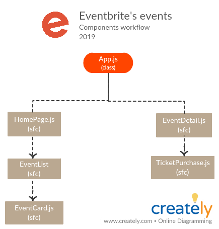

# Eventbrite event interface

_Single Page Application for Eventbrite, using React. The app, is about an event interface using the [Public Eventbrite API](https://www.eventbrite.com/platform/api), which allows filtering by city and type of event. Next, the structure of application components:_



## Starting 🚀

_These instructions will allow you to obtain a copy of the project on your local machine for development and testing purposes._

1. Clone the repository: git clone https://github.com/Adalab/fairfax-m4-eventbrite-eventos

2. You can also Fork the project so you'll have it on your GitHub profile.

3. To launch the project and see it in the browser: npm start

4. To add and upload the changes you make: git add . / git commit -m 'message' / git push origin 'name-of-the-branch'

### Requirements 📋

_To use the application you must have the following:_

1. An API key, which you can obtain through the following [link](https://www.eventbrite.com/platform/)

2. In the root of the project, you must create an .env file, in which, you must write the following:
```
REACT_APP_API_KEY = put-here-your-API-key
```

3. It's ready! You already have access to Eventbrite's list of events!

## Built with 🛠️

_This project is created with[Create React App](https://github.com/facebook/create-react-app)._
>- You can learn more in [Create React App documentation](https://facebook.github.io/create-react-app/docs/getting-started).
>- To learn React, take a look at the [React's documentation](https://reactjs.org/).

_We use [Node 10.16.0 & npm 6.9.0](https://nodejs.org/es/download/)_

[](https://github.com/prettier/prettier)


## Authors ✒️

* **Irene Fuente** - [ifuenteromero](https://github.com/ifuenteromero)
* **Irene Gómez** - [irenegf83](https://github.com/irenegf83)
* **Libertad Pozos** - [libertadpozos](https://github.com/libertadpozos)
* **Saray Fernández** - [sarayfg](https://github.com/sarayfg)
* **Clarette Terrasi Díaz** - [cterrasid](https://github.com/cterrasid)

## License 📄

This project is under the MIT License - see the file [LICENSE.md](LICENSE.md) for details

## Our gratitude 🎁

_To all the [Eventbrite](https://www.eventbrite.com/) Spain team, for their valuable collaboration and willingness, especially to:_

* **Stephanie Pi**
* **Jean Yves Chanal** - [sevy07](https://github.com/sevy07)
* **Marta Valls**
* **Emilio García**
* **Diego Muñoz**
* **Jorge Ferreiro**
* **Jorge Barata**
* **Mario Montes**
* **Marisa**
